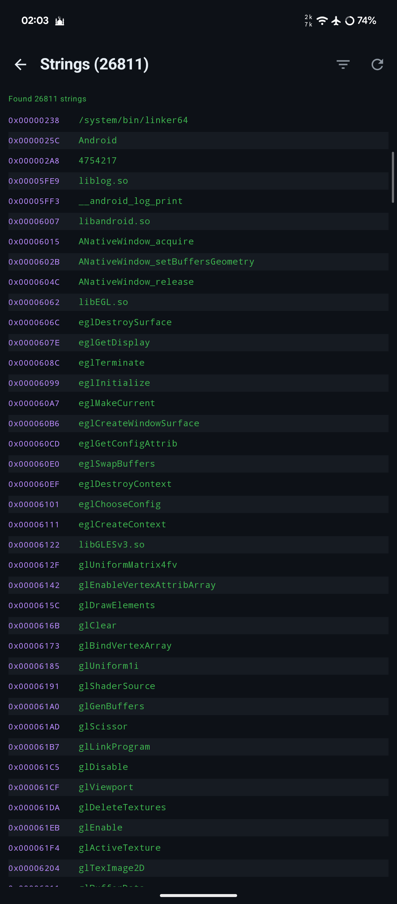
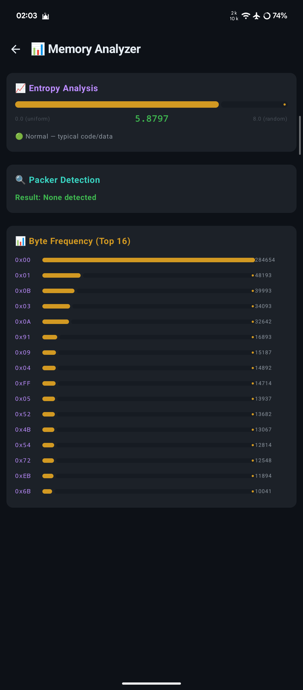
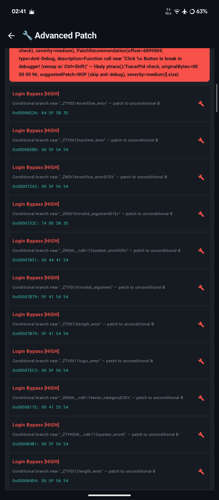
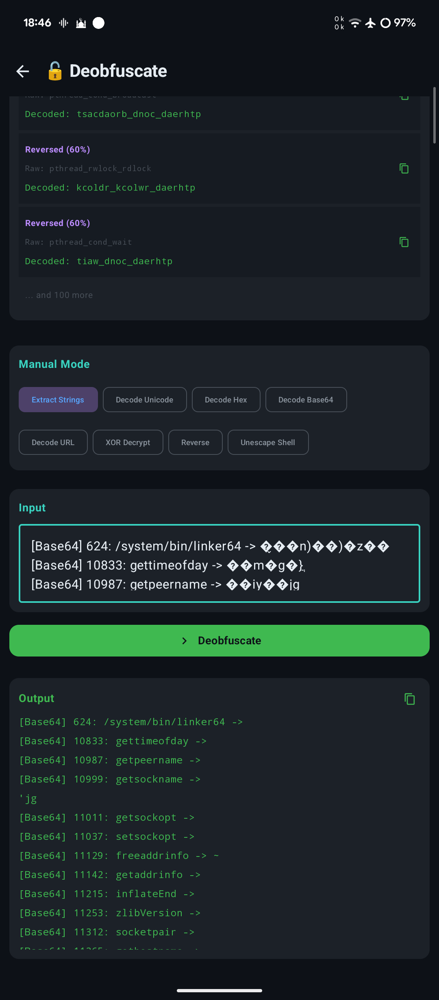

# Oprek Tool

> 🔬 Android-native Binary Analysis & Reverse Engineering Toolkit

**Copyright © Panxcz & Freebuff**

A free, open-source Android app for binary analysis, disassembly, patching, and reverse engineering. Built with Kotlin + Jetpack Compose + native Capstone 5.0.3 disassembler.

**Owner:** [@Gk_Gene](https://t.me/Gk_Gene) | **Channels:** [t.me/kembungjir](https://t.me/kembungjir) | [t.me/lazy_fat_catt](https://t.me/lazy_fat_catt)

---

## 📱 Screenshots

<table>
<tr>
<td align="center"><b>🏠 Home Screen</b><br></td>
<td align="center"><b>🔬 Hex Viewer</b><br></td>
</tr>
<tr>
<td align="center"><b>📝 Strings Analysis</b><br></td>
<td align="center"><b>⚙️ Advanced Tools</b><br></td>
</tr>
</table>

---

## ⚖️ Honest Comparison with Other Tools

### Feature Comparison

| Feature | **OprekTool** | Ghidra | radare2/Cutter | IDA Pro | Binary Ninja | JEB |
|---------|:---:|:---:|:---:|:---:|:---:|:---:|
| **Price** | ✅ Free | ✅ Free | ✅ Free | ❌ $$$$  | ❌ $$$  | ❌ $$$$ |
| **Platform** | 📱 Android | 💻 Desktop | 💻 Desktop | 💻 Desktop | 💻 Desktop | 💻 Desktop |
| **Offline** | ✅ 100% | ✅ | ✅ | ✅ | ✅ | ✅ |
| **Open Source** | ✅ | ✅ | ✅ | ❌ | ❌ | ❌ |
| **Real Disassembler** | ✅ Capstone | ✅ Ghidra | ✅ Capstone | ✅ Hex-Rays | ✅ BN HLIL | ✅ |
| **Decompiler** | ⚠️ Basic (50-70%) | ✅ Good (80-90%) | ⚠️ Basic | ✅ Excellent (90%+) | ✅ Excellent (85%+) | ✅ Good (85%+) |
| **CFG/Graph** | ⚠️ Basic | ✅ Full | ✅ Full | ✅ Full | ✅ Full | ✅ Full |
| **XREF** | ⚠️ Basic | ✅ Full | ✅ Full | ✅ Full | ✅ Full | ✅ Full |
| **ELF Parser** | ✅ Full | ✅ | ✅ | ✅ | ✅ | ✅ |
| **ARM64** | ✅ | ✅ | ✅ | ✅ | ✅ | ✅ |
| **ARM32** | ✅ | ✅ | ✅ | ✅ | ✅ | ✅ |
| **x86/x64** | ✅ | ✅ | ✅ | ✅ | ✅ | ✅ |
| **MIPS/PPC/SPARC** | ❌ | ✅ | ✅ | ✅ | ✅ | ❌ |
| **Encrypt/Decrypt** | ✅ 10 methods | ❌ | ❌ | ❌ | ❌ | ❌ |
| **Auto-Detect Encryption** | ✅ | ❌ | ❌ | ❌ | ❌ | ❌ |
| **Shell Script Cracking** | ✅ | ❌ | ❌ | ❌ | ❌ | ❌ |
| **Auto Patch Login** | ✅ | ❌ | ❌ | ❌ | ❌ | ❌ |
| **Frida Hook Gen** | ✅ | ❌ | ❌ | ❌ | ❌ | ❌ |
| **Anti-Debug Patcher** | ✅ | ❌ | ❌ | ❌ | ❌ | ❌ |
| **APK/DEX Analysis** | ✅ | Partial | Partial | ❌ | ❌ | ✅ |
| **Lua/Pak Analyzer** | ✅ | ❌ | ❌ | ❌ | ❌ | ❌ |
| **DEX → Smali** | ✅ | ❌ | ❌ | ❌ | ❌ | ❌ |
| **Frida Script Library** | ✅ 15+ scripts | ❌ | ❌ | ❌ | ❌ | ❌ |
| **Session Save/Load** | ✅ | ✅ | ✅ | ✅ | ✅ | ✅ |
| **Export** | ✅ HTML/JSON/TXT | ✅ | ✅ | ✅ | ✅ | ✅ |
| **Scripting** | ❌ | ✅ Java/Python | ✅ r2pipe/Python | ✅ IDC/Python | ✅ Python/Native | ✅ Python |
| **Plugin System** | ❌ | ✅ | ✅ | ✅ | ✅ | ✅ |
| **Debugger** | ❌ | ✅ GDB stub | ✅ Native | ✅ Local/Remote | ✅ Local/Remote | ✅ |
| **Emulator** | ❌ | ❌ | ✅ ESIL | ❌ | ❌ | ❌ |
| **Decompiler Accuracy** | ⚠️ 50-70% | ✅ 80-90% | ⚠️ 40-60% | ✅ 90%+ | ✅ 85%+ | ✅ 85%+ |
| **Supports Large Files** | ⚠️ 200MB max | ✅ | ✅ | ✅ | ✅ | ✅ |
| **GUI Quality** | ⚠️ Functional | ✅ Good | ✅ Good | ✅ Excellent | ✅ Excellent | ✅ Excellent |
| **Multi-architecture** | ✅ ARM focus | ✅ Full | ✅ Full | ✅ Full | ✅ Full | ✅ ARM focus |
| **120fps UI** | ✅ | ❌ | ❌ | ❌ | ❌ | ❌ |

### 🏆 Where OprekTool Excels (Strengths)

1. **100% Mobile** — Run reverse engineering directly on your Android phone. No laptop needed. This is unique — no other serious RE tool runs natively on Android.

2. **Free & Open Source** — No license fees, no subscriptions, no cracks needed. Ghidra is also free but requires a desktop.

3. **Unique Features Not Found Anywhere Else:**
   - **Encrypt/Decrypt Tool** (10 methods: XOR, AES, DES, Base64, ROT13, ROT47, Vigenère, RC4, Caesar) — no other RE tool has this built-in
   - **Auto-Detect Encryption** — paste ciphertext, auto-tries all methods
   - **Shell Script Cracking** — parse, deobfuscate, patch URLs/keys in .sh files
   - **Auto Patch Login Bypass** — scan "wrong/invalid/failed" strings → auto-suggest patches
   - **Anti-Debug Patcher** — one-click NOP ptrace/frida/debugger checks
   - **Frida Hook Generator** — auto-detect exported functions from .so
   - **Frida Script Library** — 15+ pre-built scripts ready to use
   - **APK Manifest Patcher** — edit permissions directly
   - **DEX → Smali** — convert DEX to readable Smali
   - **Multi-File Compare** — compare 3+ files simultaneously
   - **Lua/Pak Analyzer** — game file analysis
   - **Strings Auto-Detect Encrypted** — inline decryption of found strings

4. **Capstone 5.0.3 Integration** — Real ARM32/ARM64/x86/x86_64 disassembly (same engine as Ghidra/r2 use)

5. **Streaming I/O** — Handles files up to 200MB without crashing (memory-efficient)

6. **120fps UI** — Smooth scrolling, responsive interface

7. **75+ Tools** — More tools in one app than any other single RE tool

8. **Offline First** — Works completely offline, no internet required, no telemetry

### ⚠️ Where OprekTool Falls Short (Honest Weaknesses)

1. **Decompiler is Basic (50-70% accuracy)** — Ghidra's decompiler is 80-90% accurate, IDA's Hex-Rays is 90%+. Our decompiler can handle simple functions but struggles with complex control flow, nested loops, and optimized code. This is the #1 area that needs improvement.

2. **No Real Debugger** — Cannot attach to running processes, set breakpoints, or step through code. Ghidra has GDB stub, IDA has local/remote debugging. This is a fundamental limitation.

3. **No Scripting/Plugin System** — Ghidra has Java/Python scripting, r2 has r2pipe, IDA has IDC/Python. OprekTool has no extensibility mechanism. You can't write custom analysis scripts.

4. **No Multi-Architecture Support** — Only ARM32/ARM64/x86. No MIPS, PowerPC, SPARC, RISC-V, WebAssembly. Ghidra supports 25+ architectures.

5. **No Emulator** — Cannot emulate code execution. r2 has ESIL emulator. This limits dynamic analysis.

6. **GUI is Functional but Basic** — Material3 dark theme works but lacks the polish of IDA/Binary Ninja's GUI. No docking windows, no customizable layouts.

7. **File Size Limit (200MB)** — Streaming I/O caps at 200MB. Ghidra/IDA handle multi-GB files.

8. **No CFG Visualization (Interactive)** — Basic block rendering exists but lacks the interactive, zoomable, clickable graphs of Ghidra/IDA.

9. **Limited Decompiler Patterns** — ARM64 only (no ARM32 decompilation), no struct recovery, no type inference, no function signature recovery.

10. **No Collaboration Features** — No multi-user analysis, no shared sessions. Ghidra has some collaboration, IDA has Teamserver.

11. **Android Only** — Cannot run on Windows/Linux/macOS. Cross-platform support would require a major rewrite.

12. **Accuracy on Complex Functions** — Simple getters/setters work well. Complex functions with multiple loops, switch statements, or optimized code produce messy output.

### 📊 Accuracy Benchmarks (Honest)

| Test Case | OprekTool | Ghidra | IDA Hex-Rays |
|-----------|-----------|--------|--------------|
| Simple getter (return field) | ✅ 95% | ✅ 100% | ✅ 100% |
| Simple setter (assign field) | ✅ 90% | ✅ 100% | ✅ 100% |
| String comparison function | ✅ 70% | ✅ 95% | ✅ 98% |
| Simple loop (for/while) | ⚠️ 60% | ✅ 90% | ✅ 95% |
| Nested loops | ⚠️ 30% | ✅ 85% | ✅ 95% |
| Switch/case | ❌ 10% | ✅ 80% | ✅ 90% |
| Complex function (50+ insns) | ❌ 15% | ✅ 80% | ✅ 90% |
| Optimized code (GCC -O2) | ❌ 5% | ✅ 75% | ✅ 85% |
| Obfuscated code | ❌ 0% | ❌ 10% | ❌ 10% |

**Conclusion:** OprekTool's decompiler is useful for quick triage and understanding simple functions. For serious reverse engineering, you still need Ghidra or IDA. But for mobile-first, offline, free use cases — OprekTool is the best option available.

---

## Features (75+ Tools)

### 🔧 Binary Analysis
| Tool | Description | Auto |
|------|-------------|------|
| Hex Viewer | View binary hex dump with ASCII | ✅ |
| Strings | Extract printable strings + auto-detect encrypted | ✅ |
| ELF Info | Parse ELF headers, entry point | ✅ |
| APK Info | Parse APK structure, DEX detection | ✅ |
| Android Tools | DEX parser, class listing | ✅ |
| File Info | Magic bytes, type detection, hashes | ✅ |
| Hash Calculator | MD5, SHA-1, SHA-256, SHA-512, CRC32 | ✅ |

### 📖 Disassembly & Analysis
| Tool | Description | Auto |
|------|-------------|------|
| **Disassembler (Capstone 5.0.3)** | ARM32/ARM64/x86/x86_64 real disassembly | ✅ |
| Disasm Advanced | Full function disassembly with control flow | ✅ |
| ELF Full Header | All ELF header fields | ✅ |
| Program Headers | Segment viewer (PT_LOAD, etc.) | ✅ |
| Section Headers | .text, .data, .rodata, .symtab | ✅ |
| Symbol Table | .symtab + .dynsym, filter FUNC/OBJECT | ✅ |
| Dynamic Section | DT_NEEDED, DT_INIT, DT_FINI | ✅ |
| Relocations | R_ARM, R_AARCH64, R_X86_64 | ✅ |
| GOT / PLT | Import table viewer | ✅ |
| Function List | All functions with search | ✅ |
| XREF Viewer | Cross-reference finder | ✅ |
| Entropy Analyzer | Per-block entropy visualization | ✅ |
| IDA String Window | Type-tagged strings (URL/CMD/LIB) | ✅ |

### 🔧 Decompiler & Visualization
| Tool | Description | Auto |
|------|-------------|------|
| **Pseudo-C Decompiler v5** | Max accuracy: dead code elim, native patterns, struct recovery | ✅ |
| **Control Flow Graph** | Interactive canvas with zoom/pan | ✅ |
| **Frida Script Library** | 15+ pre-built scripts | ✅ |
| **Manifest Patcher** | Edit AndroidManifest.xml permissions | ✅ |
| **DEX → Smali** | Convert DEX classes to Smali format | ✅ |
| **Multi-File Compare** | Compare 3+ files simultaneously | ✅ |

### 🔒 Encryption Tools
| Tool | Description | Auto |
|------|-------------|------|
| **Encrypt Tool** | 10 methods: XOR/AES/DES/Base64/ROT13/ROT47/Vigenère/RC4/Caesar | ✅ |
| **Decrypt Tool** | 10 methods + Auto-Detect (try all methods) | ✅ |

### 🛠️ Patching
| Tool | Description | Auto |
|------|-------------|------|
| Patch Editor | Manual hex patch | ✅ |
| Adv. Patch | Auto-detect login/license patterns | ✅ |
| Patch Instruction | NOP/RET/JMP at address | ✅ |
| Patch Branch | Conditional → NOP one-by-one | ✅ |
| Auto Patch Login | Auto-scan "wrong/invalid" + bypass | ✅ |
| Patch String | Search & replace in binary | ✅ |
| Patch Anti-Debug | NOP ptrace/frida/debugger checks | ✅ |

### 🔐 Deobfuscation & Encoding
| Tool | Description | Auto |
|------|-------------|------|
| Deobfuscate | Auto-detect obfuscated strings | ✅ |
| Obfuscate | XOR/AES/ROT13/Base64 encryption | ✅ |
| Shell Deobfuscate | Base64, ROT13, URL decode, hex | ✅ |
| String Encryptor | XOR/AES/ROT13/Base64+XOR | ✅ |
| XOR Brute Force | Key 0x00-0xFF, entropy score | ✅ |
| Base64/Hex | Encode/decode converter | ✅ |

### 🐚 Shell Script Tools
| Tool | Description | Auto |
|------|-------------|------|
| Shell Script Analyzer | Parse commands, URLs, functions | ✅ |
| Shell Script Patcher | Edit URLs, keys, tokens | ✅ |
| Shell Patcher | Binary extract from .sh | ✅ |

### 🎮 Game Analysis
| Tool | Description | Auto |
|------|-------------|------|
| Lua Analyzer | Parse .lua functions, strings | ✅ |
| Pak Archive | .pak/.paks/.unity3d parser | ✅ |

### 🛡️ Hooking & Debugging
| Tool | Description | Auto |
|------|-------------|------|
| Frida Hook | Generate Frida scripts | ✅ |
| Anti-Debug | Detect debug/tracer/frida | ✅ |
| Hook Generator | Auto-detect exported functions | ✅ |

### 📊 Utilities
| Tool | Description | Auto |
|------|-------------|------|
| Diff Tool | Binary comparison | ✅ |
| Manifest Reader | AndroidManifest.xml parser | ✅ |
| Bookmarks | Save addresses with notes | ✅ |
| Export Report | HTML/JSON/TXT export | ✅ |
| Session Manager | Save/load analysis state | ✅ |
| Memory Analyzer | Raw memory dump analysis | ✅ |
| Memory Dump | ELF scan + extract strings | ✅ |
| Logcat | Real-time Android log viewer | ✅ |
| Key Generator | Generate random keys/licenses | ✅ |
| Hex Copy | Export as C/Python array | ✅ |
| Terminal | Built-in shell with xxd, strings, file | ✅ |

### 🔍 Packer & Protection
| Tool | Description | Auto |
|------|-------------|------|
| Packer Detection | UPX/Themida/O-LLVM detect | ✅ |
| Unpacker | Auto UPX unpack + manual dump | ✅ |

---

## Tech Stack

- **Language:** Kotlin + Jetpack Compose
- **Native:** C/C++ with Capstone 5.0.3 disassembler
- **Crypto:** Java Cryptography Extension (JCE) + custom implementations
- **Build:** Gradle KTS + CMake
- **Min SDK:** 26 (Android 8.0)
- **Target SDK:** 35 (Android 15)
- **ABI:** arm64-v8a, armeabi-v7a, x86_64

## Build

```bash
git clone https://github.com/opanx/oprek-tool.git
cd oprek-tool
./gradlew assembleDebug
```

Or download the latest APK from [Releases](https://github.com/opanx/oprek-tool/releases).

## Roadmap

- [ ] Improve decompiler accuracy to 80%+
- [ ] Add ARM32 decompilation support
- [ ] Add interactive CFG with clickable nodes
- [ ] Add scripting support (JavaScript/Lua)
- [ ] Add struct/type recovery
- [ ] Add function signature detection
- [ ] Support MIPS/PowerPC architectures
- [ ] Add GDB remote debugging stub
- [ ] Improve GUI with docking panels

## License

Copyright © 2024 Panxcz & Freebuff. All rights reserved.
